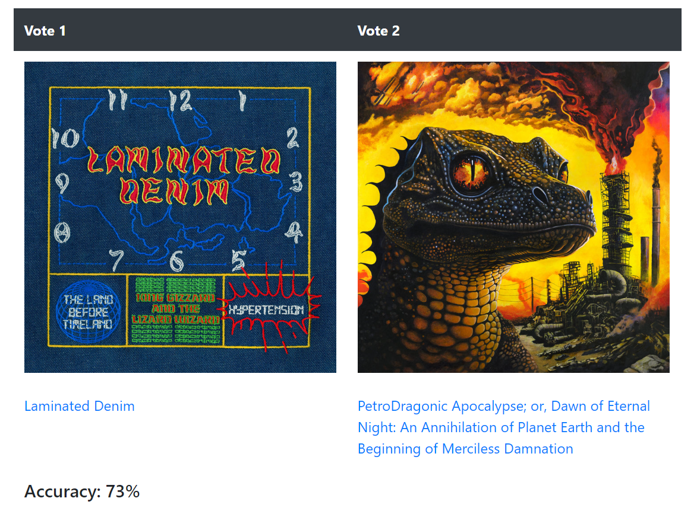
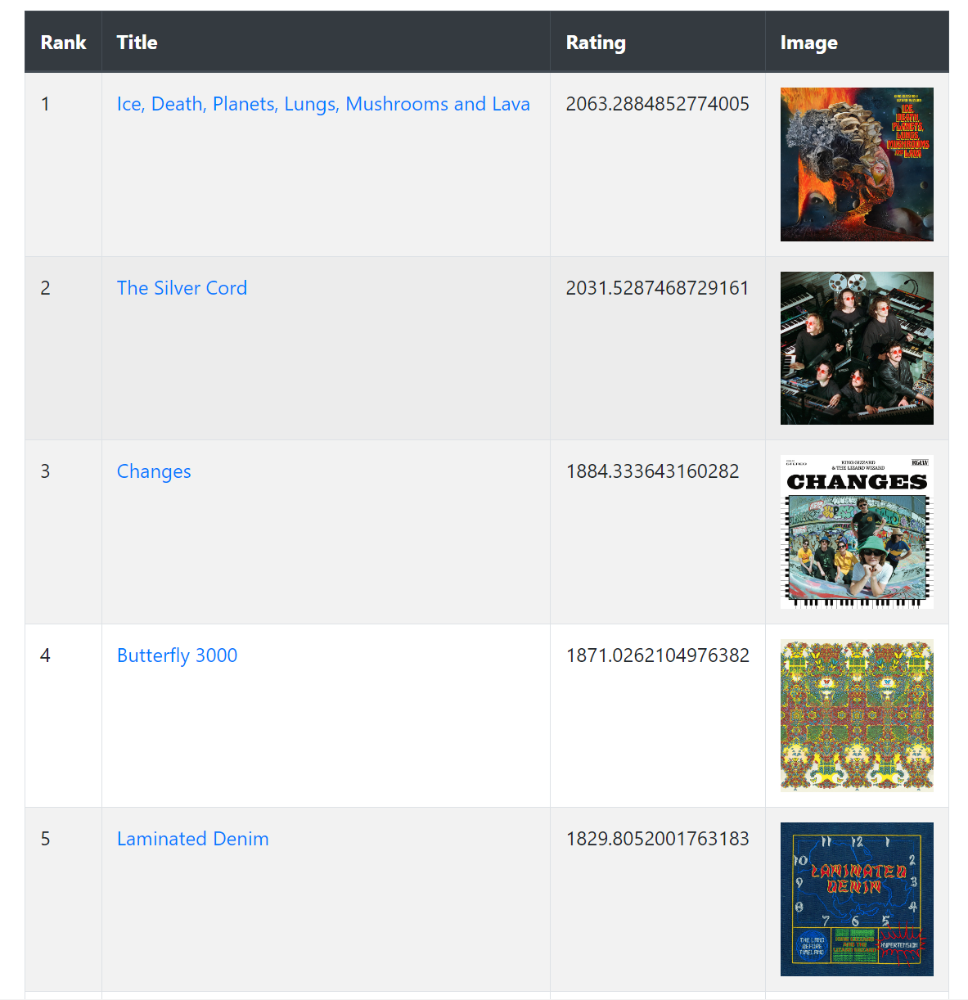

# Ranker

A web app for ranking items through pairwise comparisons using ELO and Glicko-2 algorithms.

## Features

* Web UI for creating lists, voting and viewing rankings
* Automatic metadata retrieval from URLs for comparison of products, movies, foods, etc.
* Arrow key shortcuts for quick voting
* ELO and Glicko-2 ranking algorithms
* RESTful API

## Screenshots

### Example of pairwise comparison voting

<p align="center">
    
</p>

### Example of the ranking results page

<p align="center">
    
</p>

## Usage

### Docker

```
wget https://raw.githubusercontent.com/mpoc/ranker/master/docker-compose.yml
docker-compose up -d
```

### Local

```
yarn install
yarn prod
```
